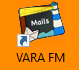
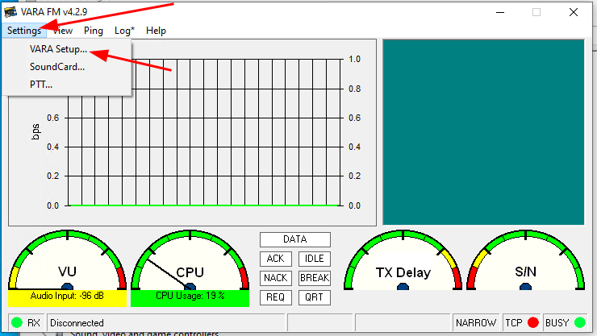
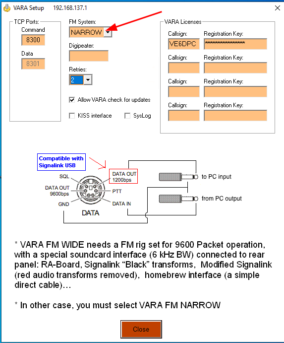
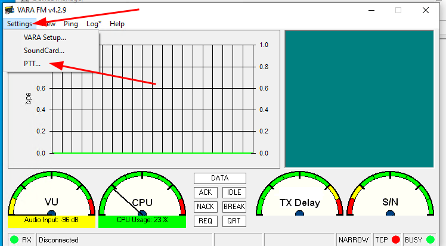
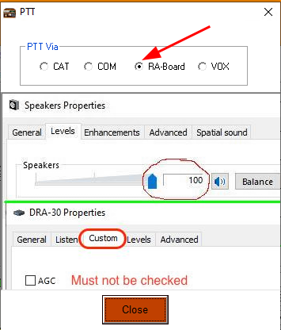
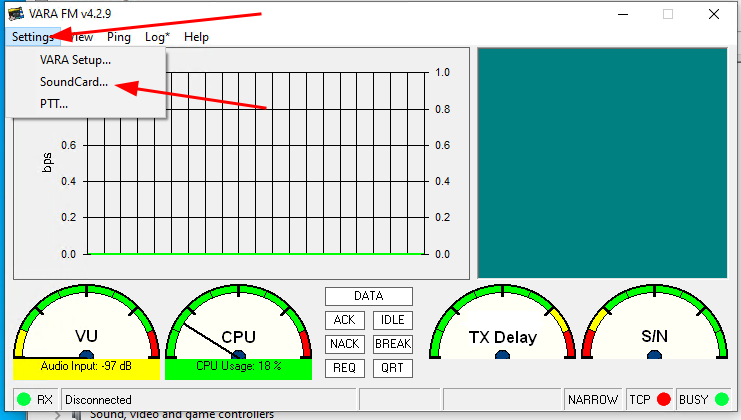
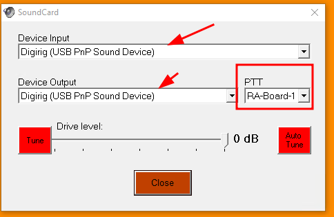
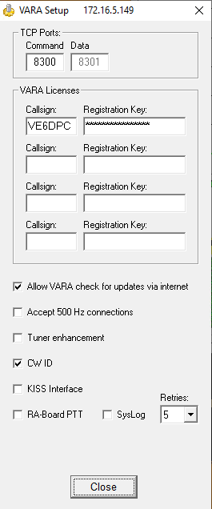
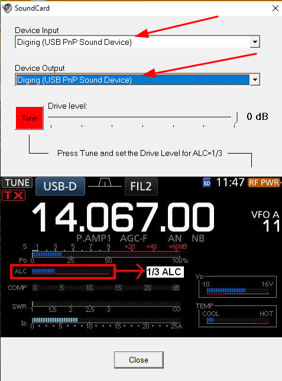
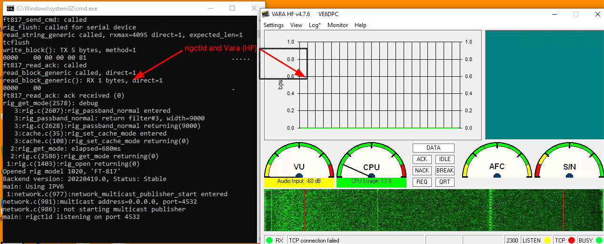

# FT818nd

When configuring the FT818nd for Vara FM and HF, we need to change some parameters on the radio as well as on Vara itself.

### Configuring the radio

The following menu items need to be changed from its default values to the ones below:

| Menu Item | Function |  Value |
|-----------|----------|----------|  
| 14 | CAT RATE Set the transceiver’s circuitry for the CAT baud rate | 38400 
| 25 | DIG MIC Adjust the audio input level from terminal equipment (such as a TNC or PSK-31 sound card) during DIG (Digital) mode operation |  65
| 26 | DIG MODE Select the mode and sideband (if applicable) in the DIG (Digital) mode |  USER-U
| 39 | PKT MIC Adjust the audio input level from the TNC during 1200 bps Packet operation |  50
| 40 | PKT RATE Set the transceiver’s circuitry for the Packet baud rate |  9600 for Vara FM

### Getting Vara FM configured for the FT-818nd

For Vara FM to work with the Yaesu FT-818nd we need to setup a few things.

**VARA FM Setup**

1. Open up Vara FM

    

1. Click on `Settings->Vara Setup`

    

1. The FT-818nd supports both, **WIDE** and **NARROW** modes. With that, you can choose whatever option fits your needs under the `FM System`. If you're in doubt of which mode you should use, always fallback into **NARROW** as the RMS, even if on **WIDE**, will go into NARROW mode once it detects that the transceiver is usint it.

    >[!NOTE]
    > More details on WIDE vs NARROW:
    >
    > To use the **WIDE** option you need to also enable **9600** baud rate under the Packet rate (see Menu 40 above). To use the WIDE mode, make sure your RMS also supports that.
    >  
    > You can see that when using **NARROW** the DATA OUT pin will use 1200bps (max) whereas when using **WIDE** it will go with 9600bps. Not every transceiver will support this rate (e.g.: UV5R).

    

1. Leave the rest with their default values and close this window.

---

**PTT**

1. Click on `Settings->PTT`

    

1. Since we are using `rigctld` to automate our CAT control, our `PTT` option here will be `RA-Board-1`

    

1. Click on `Close`.
---

**Sound Card**

1. Click on `Settings->SoundCard`

    

1. Select the Digirig for both, the `Device Input` and `Device Output`. The drivel level can be set at 0 dB. `PTT` option here will be `RA-Board-1`

    

1. Click on `Close`.

### Getting Vara HF configured for the FT-818nd

For HF operations we will be using Vara.

**VARA Setup**

1. Open up Vara

    

1. Click on `Settings->Vara Setup`

    

1. You can leave most the the default here in place. Add your callsign and registration key if you have one.

    
  
1. Close this window.

---

**Sound Card**

1. Click on `Settings->SoundCard`

    

1. Select the Digirig for both, the `Device Input` and `Device Output`. The drivel level can be set at 0 dB.

    

1. Click on `Close`.

### Operating the rig

Whether on the on VHF/UHF with *Vara FM* or on the HF bands using *Vara*, the main operation will be the same: We need 1) **rigctld** for CAT control of the transceiver _AND_ **Vara** (or Vara FM) to serve as our modem.

