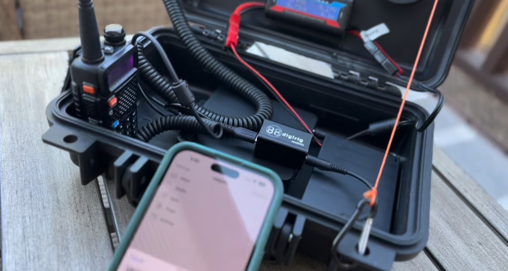

# Winlink Portable Station

The following describes a setup for a portable Winlink station, using two different radios, the Baofeng UV-5R and the Yaesu FT-818nd. Both radios are connected to a computer using a DigiRig as the audio interface.

> Extended goal:
> 
> If your hardware supports it, we will have a machine that can be used as a "headless modem for Vara". This means that we could use it as a dedicated device for Vara FM/HF and use [RadioMail](https://radiomail.app/) as a Winlink client to connect to it.

RadioMail, Baofeng, digirig and a mini-pc working together as a Winlink portable station.

## Topics:

1. [Part list and Hardware tested](part-list.md)
1. [Operating system setup](windows.md)
1. Radios:
    1. [Baofeng UV-5R](baofeng.md)
    1. [Yaesu FT-818nd](818nd.md)
1. [RadioMai](radiomail.md)
1. Carrying your gear:
    1. [Makeshift manpack for the Yaesu FT-818nd](manpack.md)
    1. [Hard case for the UV-5R]
1. [Power options](power.md)

## Learning resources

## Contributing
