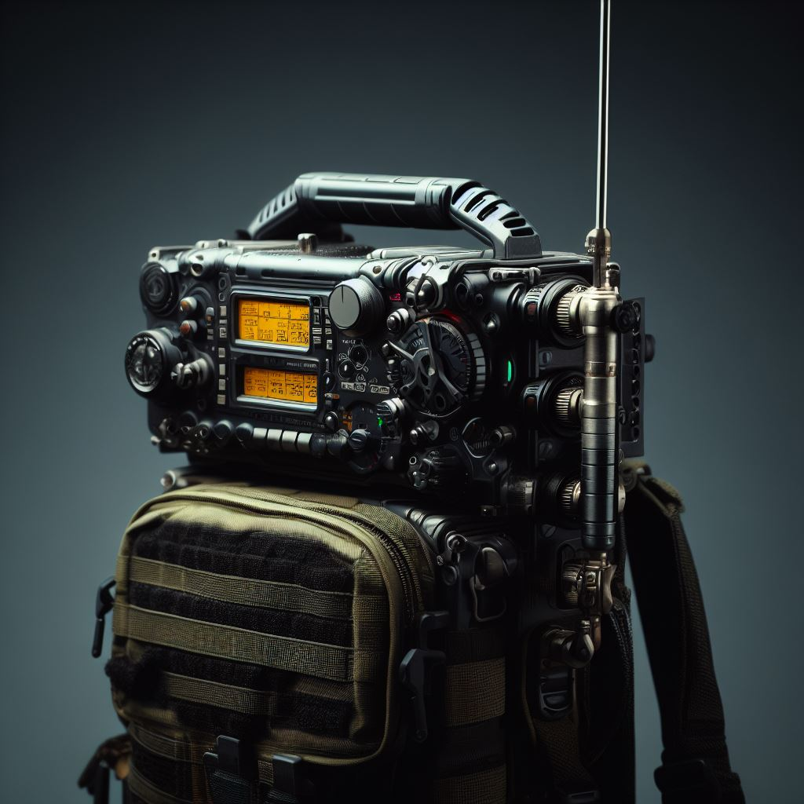

# Winlink Portable Station

The following describes a setup for a portable Winlink station, using two different radios, the Baofeng UV-5R and the Yaesu FT-818nd. Both radios are connected to a computer using a DigiRig as the audio interface.

> Extended goal:
> 
> If your hardware supports it, we will have a machine that can be used as a "headless modem for Vara". This means that we could use it as a dedicated device for Vara FM/HF and use [RadioMail](https://radiomail.app/) as a Winlink client to connect to it.

RadioMail, Baofeng, digirig and a mini-pc working together as a Winlink portable station.

## Topics:

1. [Part list and Hardware tested](part-list.md)
1. [Operating system setup](windows.md)
1. Radios:
    1. [Baofeng UV-5R](baofeng.md)
    1. [Yaesu FT-818nd](818nd.md)
1. [RadioMail](radiomail.md)
1. Carrying your gear:
    1. [Makeshift manpack for the Yaesu FT-818nd](manpack.md)
    1. [Hard case for the UV-5R](hardcase.md)
1. [Power options](power.md)

## Learning resources

Here are a few links that can enhance your knowledge on using Winlink and operating portable.

YouTube Channels:

- [WaveTalkers](https://www.youtube.com/@WaveTalkers)

- [Off-Grid Ham Radio OH8STN](https://www.youtube.com/@OH8STN)

- [The Tech Prepper](https://www.youtube.com/@TheTechPrepper)

- [KM4ACK](https://www.youtube.com/@KM4ACK)

A few selected videos:

- [Winlink Basic](https://youtu.be/TZv-hPbzyak?si=ZaziqkKpcslqrR9v)

- [Winlink Basic playlist from WaveTalkers](https://www.youtube.com/playlist?list=PLcBrg-5drc84N1GU9zhWwCF9HisFc8L_a)

- [Winlink on iPhone & iPad with RadioMail - Setup and Use, email on the GO!](https://youtu.be/SGd9pTVA4iQ?si=lzpPZEMD69v6LmnU)

- [Winlink Email P2P | Ham Radio for Preparedness](https://youtu.be/VQNKy_ltY8o?si=rejHY-DHQGj160KQ)

- [Email over Ham Radio | Winlink Express Check-in Vara HF](https://youtu.be/eyjlhSlu19M?si=Iv_XhHtKEXAozXE4)

- [Winlink Email to Gmail | Ham Radio for Preparedness](https://youtu.be/0T2c7d-lP3w?si=tSOB-P2mOFb5_UY9)

- [Digirig setup for VaraFM with HT](https://youtu.be/MUDQYuvYAeI?si=R0Mi0iFDnd9G8_Gn)

- [My Initial Thoughts on Winlink Email for Grid Down Comms](https://www.youtube.com/watch?v=kToTYiLbK5M)

## Contributing

Want to help with this doc? Do you have a new radio or rig that would like to add here? Contributions are welcome, just do a PR against this repo.