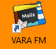
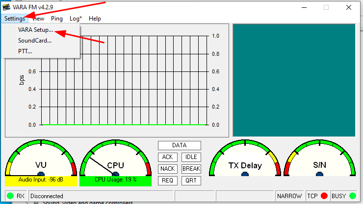
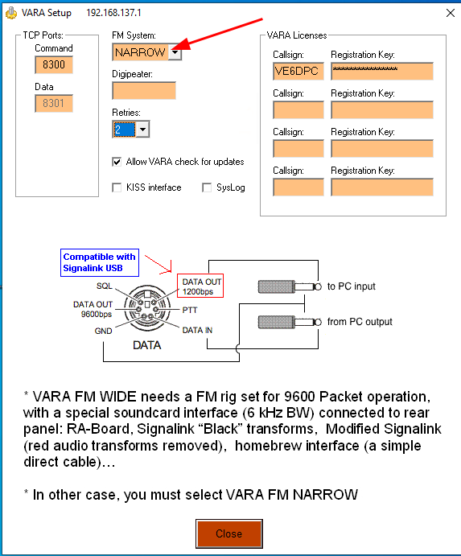
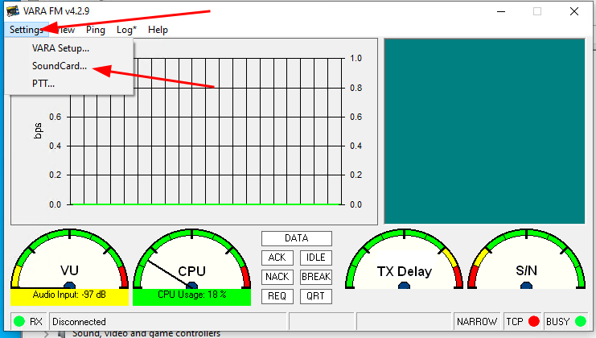
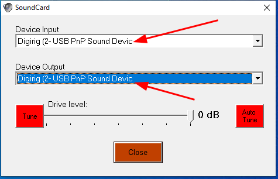
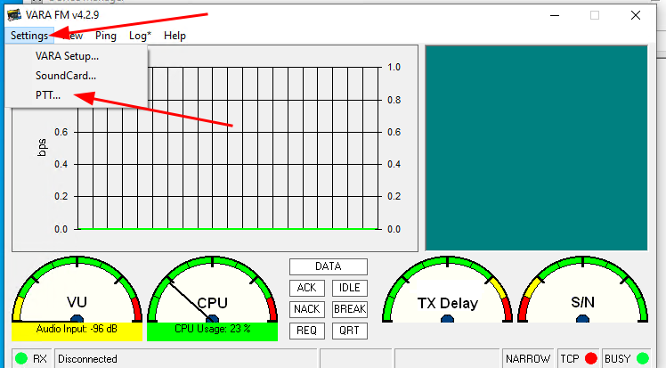
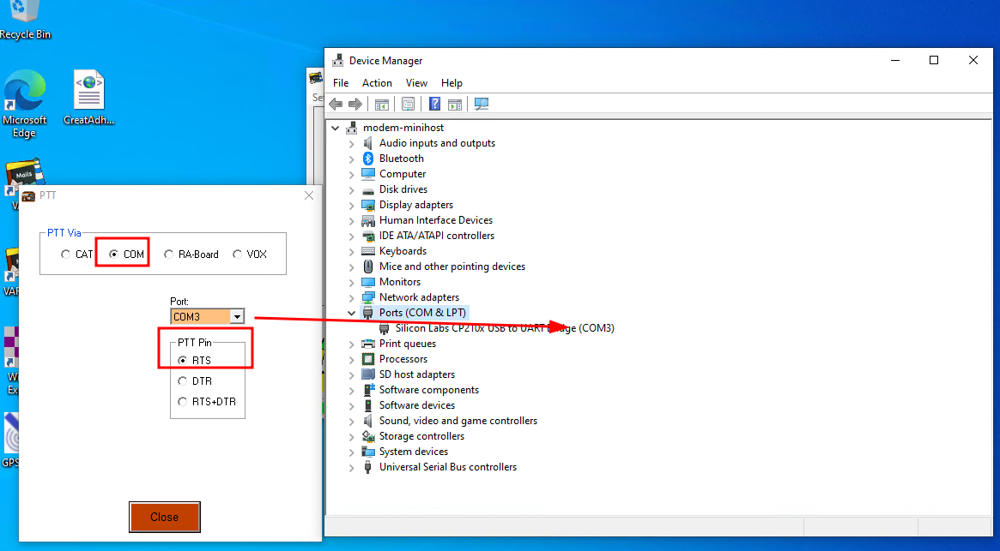

# Baofeng UV-5R

For the UV-5R there are a few changes. One important notice is that the UV5R volume knob should be turned about 3/4 of the way for Vara FM to work. Your mileage may vary here and some tests are likely needed for your setup.

| Menu Item | Function |  Value |
|-----------|----------|----------|
| 0 | SQL | OFF. Please note that you might not need to have the squelch off. During my tests I actually have it turned on to 9 due to the proximity to the local RMS tower.
| 4 | VOX | OFF

## Getting Vara configured for the UV-5R

For Vara FM to work with the UV-5R we need to setup a few things.

**VARA FM Setup**

1. Open up Vara FM

    

1. Click on `Settings->Vara Setup`

    

1. Im here, the one option to note is the `FM System`, which for the Baofeng UV-5R needs to be **NARROW**. If you have a registration key now is the time to input that as well.

    

1. Leave the rest with their default values and close this window.

**Sound Card**

1. Click on `Settings->SoundCard`

    

1. Select the Digirig for both, the `Device Input` and `Device Output`

    

1. You can have the drive level to 0 dB and close this window

**PTT**

1. Click on `Settings->PTT`

    

1. In the `PTT via` select `COM`. The COM port here needs to be the same as the one showing up under the `Device Manager`.

1. Select `RTS` at the `PTT Pin` and then close this window.

    

Vara FM should now be fully configured to work with the UV5R.