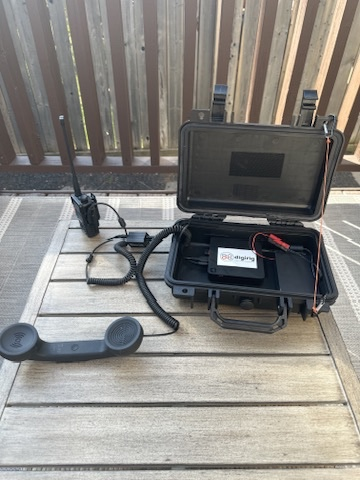

# Hard case for the UV-5R

For the UV5R, computer and batteries, you can use a hard case to store them. Internally, I've secured them using industrial grade velcro.

It's a simple setup that works well under most weather conditions and in most cases it is my go-to setup for UHF and VHF ops with Winlink. When this is up and running, you can connect to the headless mini-pc with an iOS device and use RadioMail.

I've stardardized on using PowerPole connectors everywhere now and you can see that in the picture above where the battery connects to the mini pc.

| Component | Version/Specs |  Notes |
|-----------|----------|----------|
| [Trigkey N4 Mini PC ](https://www.amazon.com/TRIGKEY-N4-Windows-Processor-Ethernet/dp/B09F6DQPHT)| Windows 10 Pro 19045.3324 | Intel Celeron N3350. 4GB of RAM. This is a 12V powered computer.
| [Digirig Mobile](https://digirig.net/product/digirig-mobile/) | | Logic Levels (default)
| [Baofeng cables kit for Digirig Mobile](https://digirig.net/product/baofeng-cords-kit-for-digirig-mobile/) | | needed if using the **Baofeng UV-5R**. We are only using the _black_ cable. The _green_ cable can be used with Chirp to program your HT.
| [MEIJIA Portable All Weather Waterproof Protective Hard Case](https://www.amazon.ca/dp/B07RZGFV59?ref%253Dppx_yo2ov_dt_b_product_details%2526th%253D1)
| [VELCRO Brand Heavy Duty Fasteners](https://www.amazon.ca/dp/B09BNPX3XJ?psc%253D1%2526ref%253Dppx_yo2ov_dt_b_product_details)