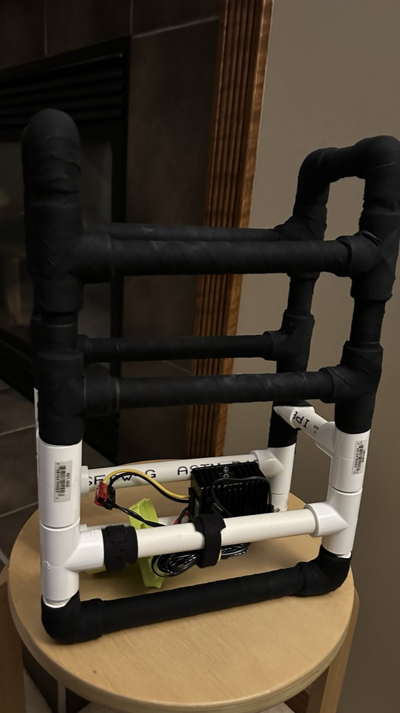

# Makeshift manpack for the FT818nd

The AI generated manpack is cooler than the actual manpack.

This is a makeshift manpack that houses a FT-818nd, an LDG z-817 autotunner, and a digirig. Cable management is done by using velcro with the entire frame for the manpack being constructed out of pvc tubbing (1/2") and hockey tape. The overall cost should be around $50 (Canadian Dollars).

## Part-list

| Quantity | Item | Notes
|-----------|----------| ----------
| 1 |  1/2" PVC Pipe - 10ft long |622454145061[^1].
| 16 | 1/2" PVC Tee | 848154050003[^1].
| 8 | PVC EL 90 | 848154051253[^1].
| 1 | Renfrew Pro Black Hockey Tape - Pack of 4, Black stick tape, 4 pack | 59585700188[^2].
|1 | [Quechua Hiking Backpack 32 L - NH Escape 500 Black](https://www.decathlon.ca/en/p/8649351/nh-500-escape-hiking-backpack-32-l) 

[^1]: Part numbers at Home Depot.
[^2]: UPC number at Walmart

## Assemblying the kit

Assembling everything and putting into the backpack is easy since the frame was cut to fit the internal storage of the backpack. You can easily modify this to fit another backpack.

**Add the hockey tape**

Add Hockey Tape to the PVC after the assembly is done. This will help with the velcro grip.

**Other features**

1. Access to the internal battery

There is enough space between the PVC crossbars to provide easy access to the internal battery compartment.

1. Cable management

With everything fully assembled, velcro can be used for cable management.

## Cutting list

TODO

Manpack during a field activation.

