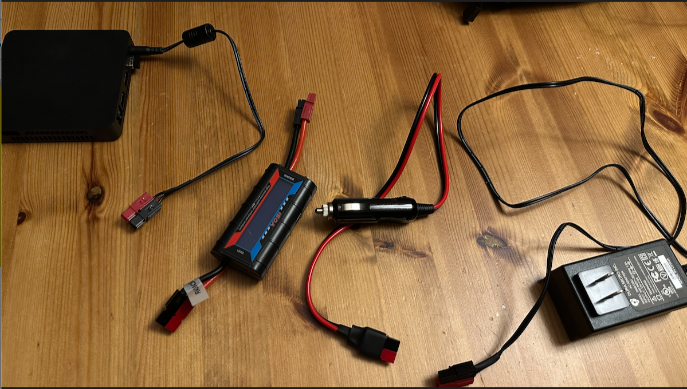
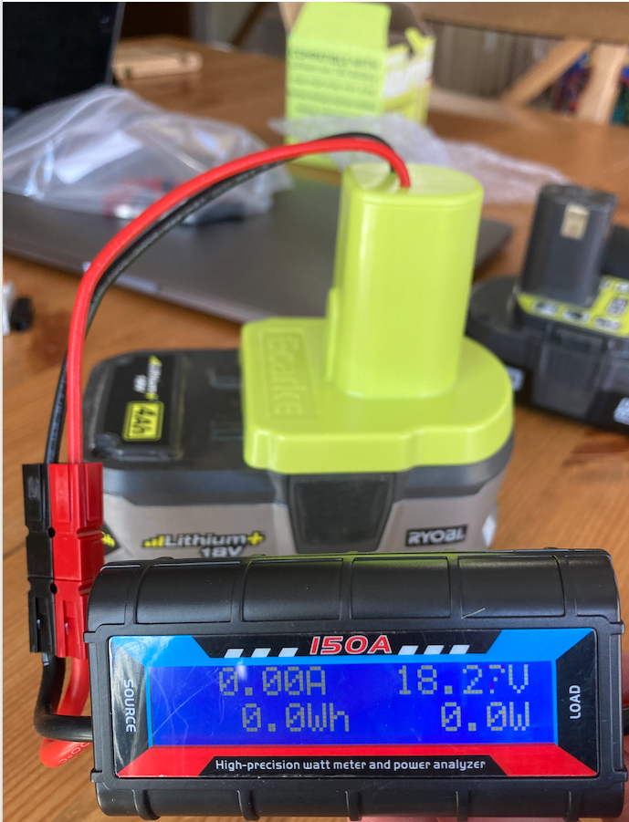
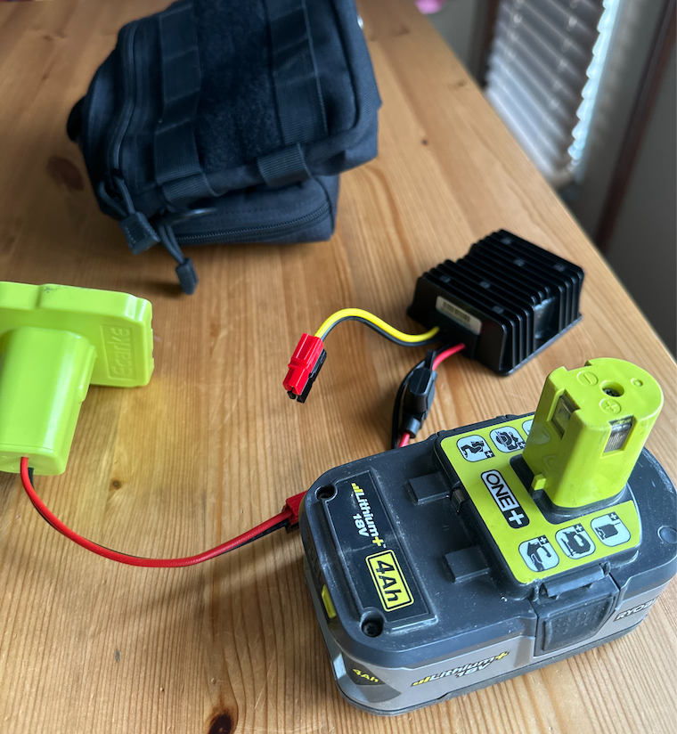

# Power options

One of the most impressive advancements in technology today is the use of 3D printing. In this blog post, we'll discuss how to use a 3D printed case with power tool batteries, and the advantage of standardizing on 12 volts for both mini-PCs and radios.

You can find the part-list at the bottom of this page with ideas and suggestions.

## Using a 3D Printed Case for Power Tool Batteries
 
3D printed cases are an excellent way to safely house and transport your power tool batteries. You can create your own custom design that perfectly fits your specific battery model, providing a secure fit. To use this case, simply place your battery inside the case and secure it. This will protect your battery from any potential damage and make it easier to carry around. The best part? You can easily print another if it wears out or if you acquire more batteries that need cases.

## The Advantage of Standardizing on 12 Volts

 
Standardizing on 12 volts for your mini-PC and radio is a smart move. 12 volts is a common voltage level for many appliances and devices, making it an easy standard to implement. Additionally, this standardization allows for easier compatibility between your various tools and devices, reducing the need for multiple power sources or adapters. This also simplifies the process of powering your devices, saving you time and reducing potential complications. Adding an inline wattmeter helps with monitoring the amount of power being delivered to the radio.

## Harnessing Power Tool Batteries with a DC to DC Buck Converter
 
When it comes to using power tool batteries, specifically those that operate at 24V, to power your FT-818nd which operates at 12V, a DC to DC buck converter is a key component to have. The buck converter works by reducing the voltage from the source, in this case, the 24V power tool battery, to a level that your device can safely and effectively use, in this case, 12V. This is achieved through a process known as 'step-down' conversion. The buck converter takes the higher voltage, and efficiently reduces it to the lower voltage, effectively allowing you to harness the power from your 24V power tool batteries to power your 12V devices like the FT-818nd. It's a simple and effective solution to voltage compatibility issues, opening up a wider range of power sources for your devices.

## Powerpoles: A New Approach to Power Interconnection
 
Powerpoles (or more commenly reffered to as Anderson PowerPoles) offer a versatile and efficient method for interconnecting power between various devices. These connectors provide a secure and reliable connection, ensuring your devices receive the power they need to operate effectively. They are simple to use, simply plug your devices into the power pole and you're good to go. With powerpoles, you can easily organize and manage your power sources, making your workspace more efficient.

When buying these, I would suggest that you also buy a crimper if you can.

## IKEA Ladda 2450mAh: The Perfect Power Source
 
Now, let's talk about using the IKEA Ladda 2450mAh to power your computer and radio. These rechargeable batteries provide a reliable and sustainable power source for your devices. With a capacity of 2450mAh, they can keep your devices running for extended periods. To use these, simply charge them up, insert them into your devices, and you're ready to go. These batteries are also eco-friendly, making them a great choice for those conscious about their environmental impact.

## Transporting Ni–MH Batteries Safely
 
When it comes to transporting Ni–MH (Nickel–Metal Hydride) batteries, it's important to do so safely and securely. A practical solution for this is to use a battery holder case designed for 8xAA batteries. These 8xAA batteries combined provide a 12V output, making them a perfect fit for your 12V standard devices. These cases often come with secure closures to keep the batteries firmly in place, protecting them from any potential damage during transport.

In addition to a battery holder case, a battery caddy can also be highly useful for carrying Ni–MH batteries. A battery caddy can hold multiple batteries of various sizes, making it an all-in-one solution for carrying your power sources. They are designed to keep your batteries organized and easily accessible, which can be very convenient when you're on the go. Simply place your Ni–MH batteries in the designated slots, secure them, and you're ready to transport your batteries safely.

This combination of a battery holder case and a battery caddy provides an effective and simple way to transport your Ni–MH batteries. Not only does it ensure safety and organization, but it also allows for easy access to your batteries whenever you need them.

| Component | URL
| - | -
| Using a 3D Printed Case for Power Tool Batteries | [Ecarke for Power Wheels Adaptor for Ryobi 18V One+ P108 P107 P102 Battery Dock Power Connector](https://www.amazon.ca/gp/product/B09839SHRK/ref=ppx_yo_dt_b_search_asin_title?ie=UTF8&th=1)
| 12V plug | [Carviya 12V 24V Heavy Duty 16AWG 0.5M 15A 20A Male Plug Cigarette Lighter Adapter Power Supply Cable For Car inverter,Air pump,electric cup (1.64ft)](https://www.amazon.ca/gp/product/B071YH69GJ/ref=ppx_yo_dt_b_search_asin_title?ie=UTF8&th=1)
| Measuring power | [High Precision Watt Meter Voltage Amp Meter Power Analyzer, 4.8V~60V 130A, with a Digital LCD Display, Mainly Used for RC Model Airplane Watt Meter](https://www.amazon.ca/Precision-Voltage-Analyzer-4-8V-60V-Airplane/dp/B089M5KTCZ/ref=sr_1_7?keywords=wattmeter&qid=1696968989&sr=8-7)
| Buck converter | [https://www.amazon.ca/gp/product/B08YYK7D7S/ref=ppx_yo_dt_b_search_asin_title?ie=UTF8&th=1](https://www.amazon.ca/gp/product/B08YYK7D7S/ref=ppx_yo_dt_b_search_asin_title?ie=UTF8&psc=1)
| Powerpoles | [Amazon](https://www.amazon.ca/Anderson-Powerpole-Connectors-Pair-Amp/dp/B00W8TN4KY/ref=sr_1_5?adgrpid=1356797581904136&hvadid=84800368728574&hvbmt=bp&hvdev=c&hvlocphy=5026&hvnetw=o&hvqmt=p&hvtargid=kwd-84800019590698%3Aloc-32&hydadcr=23283_13567324&keywords=anderson%2Bpower%2Bpole%2Bconnectors&qid=1696967605&sr=8-5&th=1).
| Powerpoles crimper | [Zhushan AMP Powerpole Crimper,Ratcheting Wire Crimper Manual Tool for AMP 15/30/45 Cable Connectors](https://www.amazon.ca/gp/product/B087473NBL/ref=ppx_yo_dt_b_search_asin_title?ie=UTF8&psc=1)
| IKEA rechargeable Ladda batteries | [IKEA Ladda 2450mAh](https://www.ikea.com/ca/en/p/ladda-rechargeable-battery-hr06-aa-1-2v-50504692/)
| Battery Holder Case | [Battery Holder Case, Portable 8X AA 12V Battery Storage Box with Cover & ON/Off Power Switch](https://www.amazon.ca/gp/product/B08791ZNX7/ref=ppx_yo_dt_b_search_asin_title?ie=UTF8&psc=1)
| Transporting your batteries |[Storacell by Powerpax AA 12-Pack Battery Caddy, Yellow](https://www.amazon.ca/gp/product/B004YG7JXW/ref=ppx_yo_dt_b_search_asin_title?ie=UTF8&th=1)
