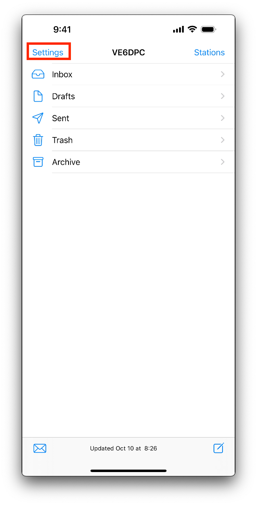
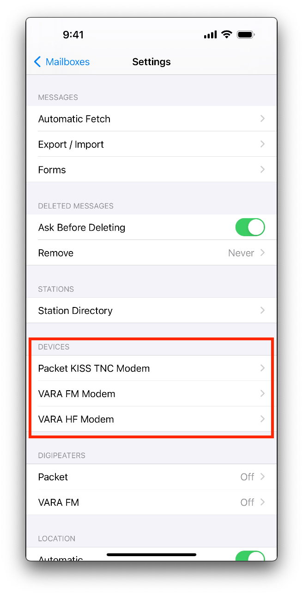
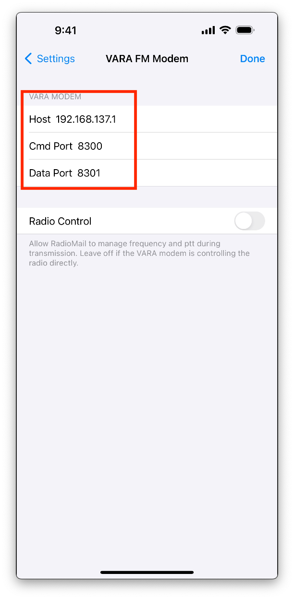
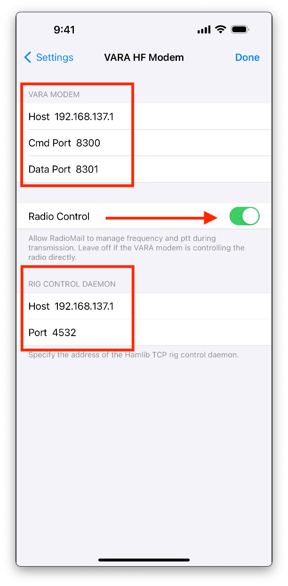

# Setting up RadioMail

[RadioMail](https://radiomail.app/) provides the best Winlink email experience on a mobile device. It is an iOS app that allows operators to use Winlink while portable. For more information on how to use RadioMail, take a look at this presentation on YouTube by Georges Auberger WH6AZ, the creator for RadioMail.

Procedure:

1. Open RadioMail and then open the `Settings` option.

    

1. Open the `Vara FM Modem` option under **Devices**
    
    

1. Set the IP address and port numbers for the Vara FM modem. By default, Windows will have this network created as a `192.168.137.0/24` with `192.168.137.1` ast the default gateway.

    

1.  For the UV5R this is the end of the setup. From this point you should be able to select a repeater with Vara FM capabilities and use Vara FM as a modem in the mini-pc.

If using a radio that supports HF, you can now setup Vara HF. The procedure is very similar to Vara FM:

1. Open `Settings`->`Vara HF`. Add the IP address of the default gateway (e.g.: 192.168.137.1). If using `rigctld` add the same IP of the default gateway here and the default port number for `rigctld` of **4532**

    

With this, you are now ready to use RadioMail with a Vara FH and HF modem.