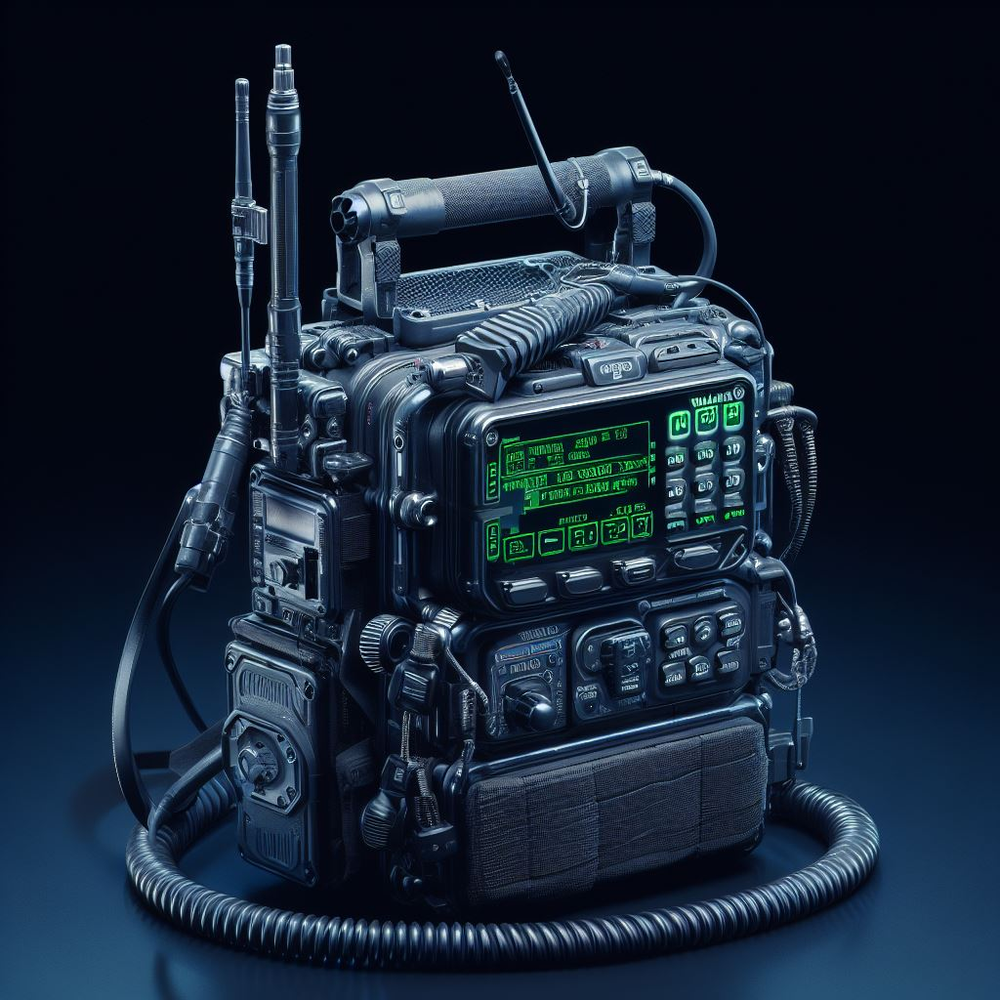

# Makeshift manpack for the FT818nd

The AI generated manpack is cooler than the actual manpack.

This is a makeshift manpack that houses a FT-818nd, an LDG z-817 autotunner, and a digirig. Cable management is done by using velcro with the entire frame for the manpack being constructed out of pvc tubbing (1/2") and hockey tape. The overall cost should be around $50 (Canadian Dollars).

## Part-list

| Quantity | Item | Notes
|-----------|----------| ----------
| 1 |  1/2" PVC Pipe - 10ft long |622454145061[^1].
| 16 | 1/2" PVC Tee | 848154050003[^1].
| 8 | PVC EL 90 | 848154051253[^1].
| 1 | Renfrew Pro Black Hockey Tape - Pack of 4, Black stick tape, 4 pack | 59585700188[^2].

[^1]: Part numbers at Home Depot.
[^2]: UPC number at Walmart