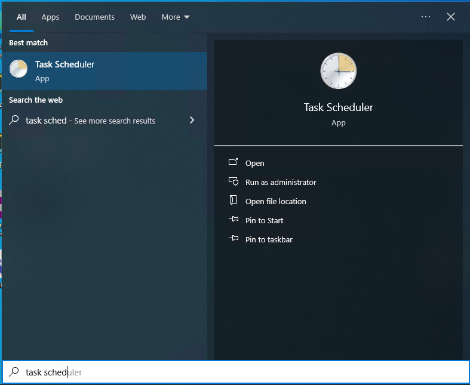
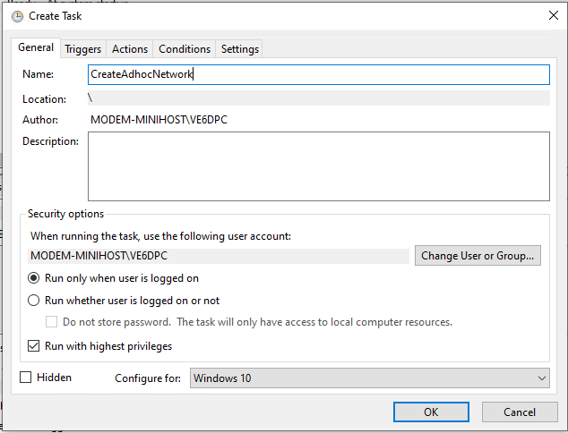
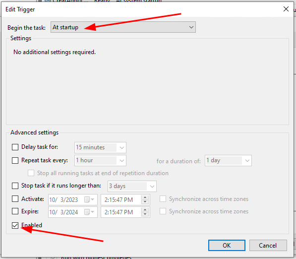
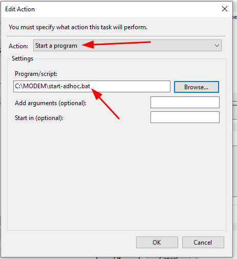
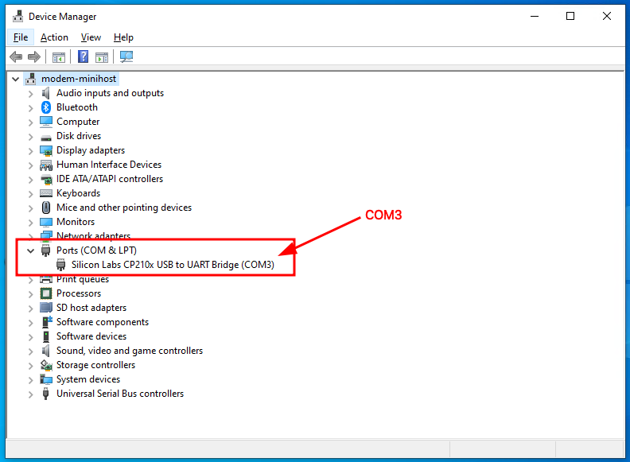
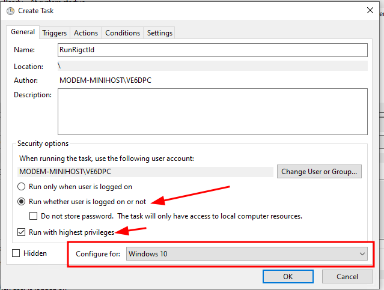

### Windows setup

Currently setup was tested on computers running Windows 10 Pro but other versions of Windows 10 and 11 should work as well. 

### Installing the required programs

For digirig to interface with Windows, we need a combined driver (serial and audio):

1. Download and Install CP210x_Universal_Windows_Driver from [here](https://www.silabs.com/developers/usb-to-uart-bridge-vcp-drivers?tab%253Ddownloads)


For our modem, we will be using Vara. On this topic, you can use the free version of Vara but the paid version is recommended due to the increase in speed.

1. Download and install Vara from [here](https://rosmodem.wordpress.com/).
    
    > NOTE: 
    >
    > In here you could opt to have a dedicated Vara "modem headless machine" with either Vara FM, Vara HF or both. 

To control our radio (FT818nd), we will be using `rigctld`. This will allow for CAT control when using RadioMail on iOS:

1. Install `rigctld`, available as part of the `hamlib` library [here](https://github.com/Hamlib/Hamlib/releases/tag/4.5.5). Unzip this under `C:\hamlib` as we will be referencing this directory later in this doc.

> OPTIONAL STEPS:
> 
> Optionally, you could install the [Winlink Express client](https://downloads.winlink.org/User%2520Programs/) on this machine and use it either localy or through Remote Desktop.

### Adding automation

After installing these softwares, we will now move into adding a few configurations that will allow the machine to work as a headless modem. 

**Adding an adhoc network**

The Macbook Air that I used for this project uses an Intel wireless interface that support `hostednetwork` by default. This is important since we will be creating a wireless hotspot that we can use to connect our iOS devices and use RadioMail. You can either use the provided script (under `scripts/start-hostspot`) or create one manually - make sure you edit this to your like, for instance, change the ssid and key.

Here is the `start-adhoc` script:

```bat
# Start hostednetwork on Windows 10
REM Starting hostednetwork
netsh wlan set hostednetwork mode=allow ssid=VE6DPC-MODEM key=CHANGEME
netsh wlan start hostednetwork
```
Save this script under **`C:\MODEM`**

With this bat script in place, we can proceed by creating a Task to automate its run during the bootstraping process of Windows.

Procedure:

1. Open `Task Scheduler`


1. Create a task with the following values
    1. Click on `Create Task`
    1. Give your task a Name.
    1. Under `Security options` choose:
        1. `Run whether user is logged on or not`
        1. `Run with highest privileges`
    1. Under `Configured for` choose `Windows 10`

    

    1. Select the `Triggers` tab and then `New`. Enable the following values:

    

    1. Under `Actions` click on `New`. Inside of the `Edit Action` window select `Action: Start a program` and then select the bat script that starts your adhoc network as showed here:

    

    1. Click on `OK` to save your task.

**Adding a task for rigctld (FT-818nd only)**

If you are using the FT818nd - or another radio that supports CAT from rigctld - then you could create a script and a task under the Windows Task Scheduler to launch rigctld. You will find an example of a working `rigctld` bat file in the `scripts`  folder. 

Here is `start-rigctld` bat script: 

```bat
# Configuration for the FT817/FT818nd using digirig on COM3
REM Start rigctld
"C:\hamlib\bin"\rigctld.exe -m 1020 -s 38400 -r COM3 -v
```

Breaking down this command:

| flag | notes
| ----- | ----
| -m | selects the radio model. In this example 1020 is the Yaesu FT-817/818
| -r | serial port connected to the radio. In this case COM3
| -s | serial port speed for CAT control. In this example 38400. This needs to be configured in the FT818nd on Menu item 14
| -v | verbose output. You can increase this to `-vvvv` to have more information on rigctld, which is very useful when configuring your radio.

How do I find what COM port my dgirig is installed?

Open the `Device Manager` on Windows and then `Ports (COM & LPT)`. Look under the `Silicon Labs CP210x USB to UART Bridge` device. The following is an example of this device configured under *COM3*



In the next steps we will create a task that will run `rigctld` automatic for us after the user logs into the PC.

Procedure: 

1. Open `Task Scheduler`


1. Create a task with the following values
    1. Click on `Create Task`
    1. Give your task a Name.
    1. Under `Security options` choose:
        1. `Run whether user is logged on or not`
        1. `Run with highest privileges`
    1. Under `Configured for` choose `Windows 10`

    

    1. Select the `Triggers` tab and then `New`. Enable the following values:


    1. Under `Actions` click on `New`. Inside of the `Edit Action` window select `Action: Start a program` and then select the bat script that starts your adhoc network as showed here:


    1. Click on `OK` to save your task.